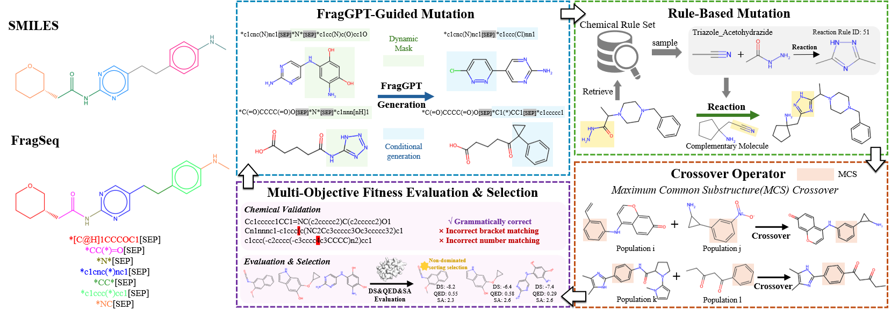

# FragEvo: A Molecular Language Model Driven Genetic Algorithm for Multi-Objective Molecular Generation

We introduce FragEvo, an evolutionary algorithm framework guided by a fragment-based language model (FragMLM).

In our model, consisting of four main modules:

(1) FragMLM-Guided Mutation — semantic, fragment-level edits proposed by FragMLM; 

(2) Rule-Based Mutation — chemically valid transformations via documented reaction rules; 

(3) Crossover Operator — recombination by exchanging molecular substructures; 

(4) Multi-Objective Fitness Evaluation & Selection — multi-criterion assessment and selection to discard invalid molecules and drive iterative population optimization.

 

## Installation

### environment
The required environmental dependencies for this project are listed in the  `fragevo.yml` file. You can easily create and activate the environment using Conda:
```bash
conda env create -f fragevo.yml
conda activate fragevo
```
#### Docking toolchain
- MGLTools:([MGLTools downloads](https://ccsb.scripps.edu/mgltools/downloads/))
Place/extract MGLTools under the project root (e.g. `./mgltools_x86_64Linux2_1.5.6/`).
```bash
tar -zxvf <mgltools-*.tar.gz>
cd mgltools_x86_64Linux2_1.5.6
./install.sh
cd ..
```
- AutoDock Vina ([autodock vina downloads](https://autodock-vina.readthedocs.io/en/latest/index.html))/ QVina2 ([qvina2downloads](https://qvina.github.io/))
Place the docking executable under the project root, or use the bundled executables from the AutoGrow fork: `./autogrow/docking/docking_executables/`.
```bash
chmod +x ./autodock_vina_*/bin/vina
```

### AutoGrow (FragEvo fork)
Fork of AutoGrow4.0 with minor modifications for FragEvo (GA operators + docking pipeline):
```bash
git clone https://github.com/tg929/autogrow.git autogrow
```
Place `autogrow/` under the project root directory.

### Initial population
The initial population is under `datasets/initial_population/`. You can also provide your own initial population file and set its path in `fragevo/config_fragevo.json` (`workflow.initial_population_file`).

### FragMLM pre-trained weighted
<u><a href="https://drive.google.com/drive/folders/1BWxy8PBHk6zTSI1bTdrp-G2fS82uhT_B">Click here to download the weight files</a></u>

After downloading, please place the weight files in the `./fragmlm/weights`.
## Usage
Model-generated molecule results and analysis outputs are saved under `results/`.
### 1.  Mini Test
```bash
python FragEvo_main.py --config fragevo/config_fragevo.json --receptor parp1 --output_dir output
```
### 2. Comprehensive Performance Evaluation and Comparative Analysis

```bash
python FragEvo_main.py --config fragevo/config_fragevo.json --all_receptors --output_dir output_all
```
#### 1) Single objective
To set : ./fragevo/congfig_fragevo.json/ "selection_mode": "single_objective";
#### 2) Multi-objectives 
To set : ./fragevo/congfig_fragevo.json/ "selection_mode": "multi_objective".

### 3. Benchmark Against Genetic and Learning-Based Baselines
#### CompScore 
```bash
python FragEvo_compscore.py --config fragevo/config_fragevo_compscore.json --all_receptors --output_dir FragEvo_output_compscore
```
